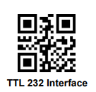
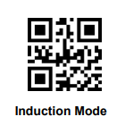

# GM67 Scanner Setup

The GM67 barcode scanner must be configured for TTL serial output before first use.
Configuration is done by scanning special QR codes with the scanner itself — the settings
persist in the scanner's own NVS flash and survive power cycles.

> QR code images below are sourced from
> [HA-Mealie-Barcode-Scanner](https://github.com/MattFryer/HA-Mealie-Barcode-Scanner)
> (MIT licence).

---

## Step 1 — Enable TTL serial interface (required)

Point the scanner at this QR code and scan it:



This switches the scanner from USB keyboard emulation to TTL UART output so the ESP32-S3
can receive barcodes over UART1 (TX=GPIO21, RX=GPIO14). Without this step the scanner
sends nothing to the firmware.

---

## Step 2 — Enable induction / continuous mode (recommended)



This puts the scanner in automatic-trigger mode: it scans continuously while a barcode is
in the field of view and stops when nothing is present. Without this the scanner only
triggers on a button press.

---

## Step 3 — Set 3-second same-code delay (optional)


Prevents the same barcode from being sent repeatedly while it stays in view.
The firmware already debounces in software, so this is an extra hardware-level guard.

---

## Verifying the setup

Power-cycle the scanner (disconnect and reconnect its 5 V supply) after scanning the QR
codes. On the next ESP32 boot you should see:

```
I (xxx) gm67: GM67 reader running
```

Hold a barcode in front of the scanner — it should beep and the log should show:

```
I (xxx) gm67: scan: <barcode value>
```

## Runtime settings

The following settings can be adjusted directly from the **Settings screen** in the app
— no QR codes needed:

| Setting | Options | Default |
|---------|---------|---------|
| Beep level | Off / Low / Medium / High | Medium |
| Scanner light | On scan / Always off | On scan |
| Collimation | On scan / Always off | On scan |

Changes take effect immediately and persist in the scanner's NVS.

## After a factory reset

If you scan the scanner's own factory-reset QR code (from the GM67 manual's System
Settings section), repeat Step 1 (and Step 2 if desired) before using the device again.

## References

- [GM67 User Manual on ManualsLib](https://www.manualslib.com/manual/3053105/Grow-Gm67.html)
- [HA-Mealie-Barcode-Scanner](https://github.com/MattFryer/HA-Mealie-Barcode-Scanner) — QR code images
